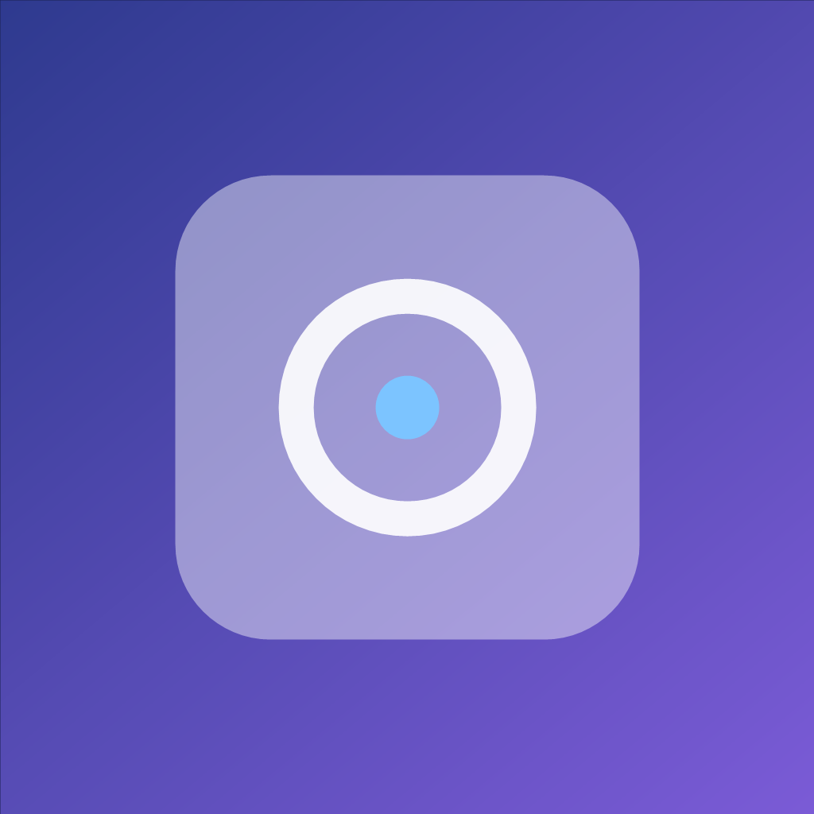
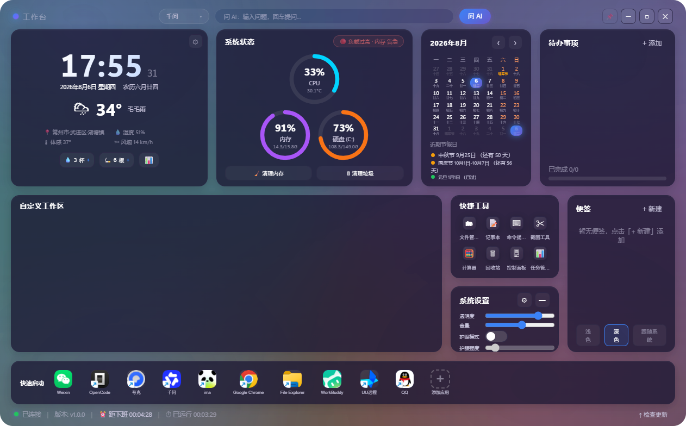

<p align="center">
  
</p>

<h1 align="center">GlassWorkspace · 玻璃工作台</h1>

<p align="center">
  <b>一块悬浮在桌面上的毛玻璃工作台 —— 时钟、天气、系统监控、AI 对话、效率工具，一站式桌面工作中心</b>
</p>

<p align="center">
  
  
  
  
  
  
</p>

<p align="center">
  <b>✨ 免登录 · 零订阅 · 本地优先 · 开箱即用</b>
</p>

---

## 🪟 这是什么？

GlassWorkspace 是一个 **Windows 桌面悬浮工作台**：半透明毛玻璃面板常驻桌面，把日常高频信息与工具聚合到一个面板里 ——

- 抬起眼就能看到：**时间 / 农历 / 天气 / 系统负载 / 待办 / 日历**
- 点一下就能用：**AI 问答、应用启动器、系统工具、一键清理**
- 完全本地运行，**不收集任何数据**，所有配置存在你电脑上

它不只是一个"好看的桌面小组件"，更是一个**真正能提升日常效率的工作中心**。

---

## 📸 界面预览



---

## ✨ 功能特性

| 模块 | 能力 |
|---|---|
| 🕐 **时钟日历** | 大时钟 + 农历 + 节假日倒计时（中秋/国庆/元旦…） |
| 🌤 **天气** | 全国省/市/区/县/镇 **级联选择**（4 万+ 行政区），open-meteo 免费数据 |
| 🖥 **系统监控** | CPU / 内存 / 硬盘 / 温度环形仪表，**6 档健康状态徽章**（优秀→异常），悬停看明细 |
| 🧹 **一键清理** | 内存清理（EmptyWorkingSet，不杀任何进程）+ 垃圾清理（仅临时目录，占用文件自动跳过） |
| 🤖 **AI 对话** | 接入 5 大平台 API（千问/DeepSeek/Kimi/智谱/豆包），**流式打字机输出**、多轮连续对话、可发图片/文件、内置 **API Key 申请引导** |
| ✅ **待办事项** | 增删改、勾选、进度条，localStorage 持久化 |
| 📝 **便签** | 增删改、展开/收起 |
| 🚀 **快速启动** | 全盘应用扫描（注册表/开始菜单/桌面）+ 真实图标提取 + **拖拽排序**，**已在运行的应用直接激活窗口** |
| 🛠 **快捷工具** | 文件管理器 / 记事本 / CMD / 截图 / 计算器 / 回收站 / 控制面板 / 任务管理器 |
| 💧 **习惯打卡** | 喝水/抽烟静默统计，**今日/本周/本月** 数据 + 近 7 天柱状图 |
| 🎨 **系统设置** | 窗口透明度 / 系统音量 / **护眼模式**（gamma 色温）/ 主题（浅/深/跟随系统） |
| 📌 **窗口交互** | 无边框毛玻璃、任意拖拽、置顶、托盘图标、缩服模式（迷你时钟条）、窗口位置记忆 |

---

## 🚀 快速开始

### 方式一：下载安装包（推荐）

前往 [Releases](https://github.com/ruichou/AI_workstasion/releases) 下载最新版安装包：

- `GlassWorkspace_x64-setup.exe`（NSIS 安装版）

### 方式二：从源码构建

> 需要 [Rust](https://www.rust-lang.org/tools/install)（1.97+）与 [Node.js](https://nodejs.org/)（18+）

```bash
git clone git@github.com:ruichou/AI_workstasion.git
cd AI_workstasion

npm install          # 安装前端依赖
npm run tauri dev    # 开发模式（热更新）
npm run tauri build  # 构建安装包（输出到 src-tauri/target/release/bundle/）
```

### 使用小贴士

| 操作 | 方法 |
|---|---|
| 移动窗口 | 按住卡片标题行 / 底部状态栏 / 顶栏空白处拖动 |
| 换城市 | 时钟卡右上角 ⚙ → 省→市→区县→镇 级联选择 |
| 配置 AI | 顶栏输入问题 → 按引导填入 API Key（含各平台申请教程）|
| 缩服模式 | 系统设置卡右上角 ▬ |
| 快速启动排序 | 直接拖动图标 |
| 退出 | 顶栏 ✕ 或托盘菜单「退出」 |

---

## 🤖 AI 对话配置

AI 面板支持 **5 大国产平台**（OpenAI 兼容协议），全部免费档起步：

| 平台 | 免费/推荐模型 | Key 申请 |
|---|---|---|
| 千问 | `qwen3.7-flash`（低价）· `qwen3.8-max`（旗舰·看图） | [阿里云百炼](https://bailian.console.aliyun.com/#/api-key) |
| DeepSeek | `deepseek-v4-flash`（送额度）· `deepseek-v4-pro` | [DeepSeek 开放平台](https://platform.deepseek.com/api_keys) |
| Kimi | `kimi-k3`（视觉·百万上下文） | [Moonshot 平台](https://platform.moonshot.cn/console/api-keys) |
| 智谱 | `glm-4.7-flash`（**免费**）· `glm-5.2`（旗舰） | [智谱开放平台](https://open.bigmodel.cn/usercenter/apikeys) |
| 豆包 | 需创建推理接入点 `ep-xxx` | [火山方舟](https://console.volcengine.com/ark) |

首次使用点击「问 AI」→ 面板内会展示对应平台的**图文引导**，跟着走即可。Key 仅保存在本机 `config.json`，不上传任何服务器。

---

## 🧱 技术栈

| 层 | 技术 |
|---|---|
| 桌面框架 | [Tauri 2](https://tauri.app/)（Rust 内核，WebView2 渲染，安装包 < 10MB 级） |
| 前端 | TypeScript + Vite，零 UI 框架依赖，手写玻璃拟态样式 |
| 系统监控 | sysinfo / WMI（温度）/ Windows API（音量、gamma、进程工作集） |
| AI 接入 | OpenAI 兼容 API，SSE 流式解析，5 平台一键切换 |
| 浏览器自动化 | 内置 Edge CDP 协议（DevTools 远程调试） |
| 行政区数据 | 民政部标准 4 级区划（省市区镇，4 万+ 条目，随包内置） |

---

## 📂 项目结构

```
AI_workstasion/
├── index.html               # 界面骨架
├── src/
│   ├── main.ts              # 全部前端逻辑（手写，无框架）
│   ├── styles.css           # 玻璃拟态设计系统（CSS 变量 + clamp 自适应）
│   └── data/pcas.json       # 全国行政区划数据
└── src-tauri/
    ├── src/lib.rs           # Rust 后端（系统 API / 流式转发 / CDP 自动化）
    └── tauri.conf.json      # 窗口与应用配置
```

---

## 🗺 Roadmap

- [x] 核心面板（时钟/天气/系统/日历/待办）
- [x] AI 直答（流式 / 多轮 / 附件 / Key 引导）
- [x] 快速启动（扫描 / 图标 / 排序 / 窗口激活）
- [x] 一键清理（内存 / 垃圾）
- [x] 全国行政区天气
- [ ] 真实版本检查与自动更新
- [ ] 自定义工作区组件（拖拽化）
- [ ] 多显示器支持优化

---

## 🔒 隐私与安全

- **零遥测**：应用不发送任何使用数据，天气/AI 均直连对应服务
- **本地存储**：配置、便签、待办、习惯统计全部存于本机
- **清理安全**：垃圾清理仅扫描系统临时目录，被占用文件自动跳过，绝不触碰用户文档
- **AI Key 安全**：仅存本地，代码内不内置任何 Key

---

## 📄 License

[MIT](LICENSE) © ruichou

---

<p align="center">
  <sub>如果 GlassWorkspace 对你有帮助，欢迎 ⭐ Star、提交 Issue 或 PR —— 你的支持是项目前进的动力</sub>
</p>
